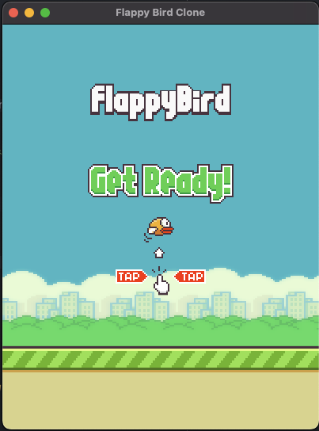

# FlappyBirdRustClone

<p align="center">
  
</p>


Welcome to FlappyBirdRustClone, a delightful recreation of the famous Flappy Bird game, implemented in Rust. This project showcases how you can build and run a cross-platform game on both desktop and iOS.

Keep in mind, this project is still under active development and was started to experement with creating games in Bevy with rust, targeting iOS. Features are missing, things may break, and it's not expected to be a complete game. The goal with this project is to learn how Bevy works, and how one can use Rust with Bevy to build games on mobile.

## Requirements

To build and run FlappyBirdRustClone, you will need to have the following tools and environments set up:

- **Rust Programming Environment**: Ensure that you have a working Rust installation. If you're new to Rust, follow the [official guide](https://www.rust-lang.org/learn/get-started) to set it up.
- **Dasel**: A utility tool for querying and updating data structures. Install it via Homebrew with:
  ```sh
  brew install dasel
- **Xcode**: Necessary for iOS builds. Make sure you have Xcode installed along with an iOS Simulator.
- **Cargo Bundle**: A Cargo subcommand for bundling Rust applications for release. Install it using:
    ```sh  
  cargo install cargo-bundle
    ```
  
- For iOS build target, you need th install the rust targets:
    ```shell
  rustup target add aarch64-apple-ios x86_64-apple-ios aarch64-apple-ios-sim
    ```

## Building the Project

### Desktop Version
To build the desktop version of the game, navigate to the root directory of the project and run:
```shell
cargo build
```
or
```shell
make desktop
```

### iOS Simulator Version
For building and running on an iOS Simulator, you can use the included Makefile. Simply execute:
```shell
make build-ios-sim
```
This command builds a .app file for the project in `target/aarch64-apple-ios-sim/debug/bundle/ios`

To run the game in an ios simulator, you'll need to get one booted and ready:

```shell
xcrun simctl boot "iPhone 15"
open /Applications/Xcode.app/Contents/Developer/Applications/Simulator.app 
```

## Contributing
Contributions to FlappyBirdRustClone are welcome! Whether it's bug fixes, improvements, or new features, feel free to fork the repository and submit a pull request.


## License

This project is licensed under MIT License. Feel free to use, modify, and distribute the code as per the license terms.


## TODOs

- [X] add collision detection for the ground and pipes
- [X] add detection for passing through pipes to add to score
- [X] add score tracking
- [X] add UI
- [ ] Restart game functionality 